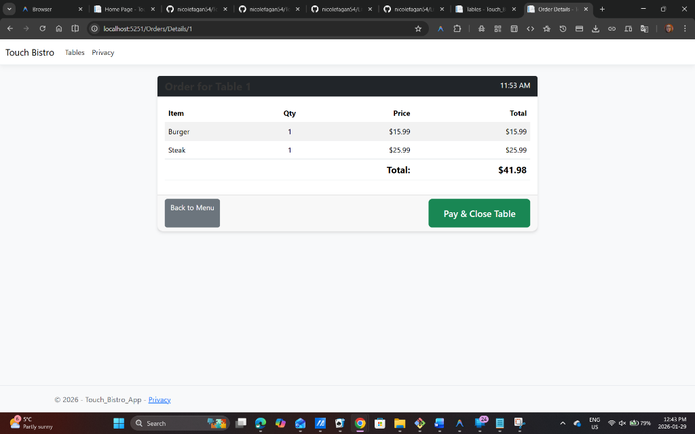

# Touch Bistro Clone

ASP.NET Core MVC application mimicking the TouchBistro POS system.

## Menu Management

- **Displays menu items** with names, prices, and categories.
- **Allows users to add items** to an order.

## Table Management

- **Shows available and occupied tables.**
- **Lets users select a table** to start an order.

## Order Workflow

- **Add/remove menu items.**
- **View order totals.**
- **Submit or clear orders.**

## POS‑Style Navigation

- **Clean, simple UI** inspired by TouchBistro’s layout.
- **Fast switching** between menu, tables, and order screens.

## 🗄️ Database & EF Core

This project uses SQLite for lightweight local storage.

### Running Migrations

If you need to rebuild the database:

```bash
dotnet ef database update
```

To add a new migration:

```bash
dotnet ef migrations add MigrationName
```

## 🚀 Getting Started

### 1. Clone the Repository

```bash
git clone https://github.com/nicolefagan54/Touch_Bistro_App.git
cd Touch_Bistro_App
```

### 2. Restore Dependencies

```bash
dotnet restore
```

### 3. Run the Application

```bash
dotnet run
```

The app will launch at: `https://localhost:5001` or `http://localhost:5251`

## 📘 About This Project

This application was created as part of a software development practicum to demonstrate:
- MVC architecture
- Database modeling
- Restaurant workflow logic
- UI/UX for POS systems
- EF Core data persistence

It is not a full production POS system, but a functional educational clone.

## 📄 License

This project is open for educational use.
Feel free to fork, modify, and learn from it.

## Screenshots

### Menu View


### Tables View


### Order Details View



